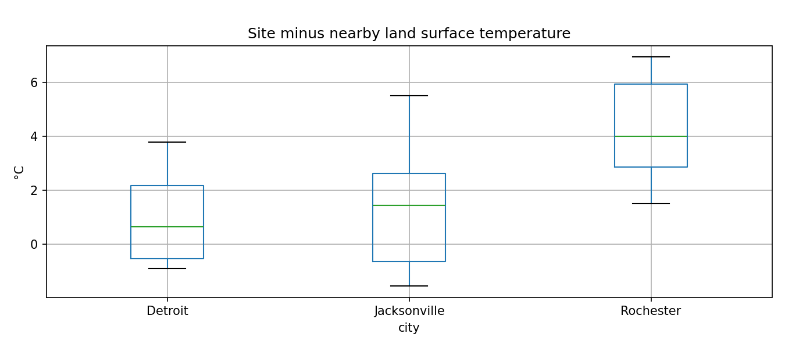

# EcoOrbit | methane and pollutant intelligence PoC

The primary workflow investigates CH4 at three international methane case-study locations using QA-screened Sentinel-5P columns and optional Carbon Mapper hyperspectral plume exports. Case-specific observations have **not** been downloaded into this package; the event dates are investigation windows, not asserted detections. As a supporting land-use feature, the existing **observed-data** US pilot studies 24 hyperspectral-observed EPA Facility Registry Service TRI-associated industrial points, eight each around Jacksonville (Florida), Rochester (New York) and Detroit (Michigan), plus 424 additional unverified registry candidates. There are 24 mapped school comparison points. 

## Submission snapshot and business use case

**Project:** EcoOrbit — Earth-observation environmental screening for industrial sites. **Team:** Zina Abohaia, and Yahya Kanjo. **Official hackathon theme:** Air Intelligence **Country:** Representing UAE. The intended end user is an environmental analyst or ESG reporting team deciding which facilities warrant a closer inspection and what evidence remains missing for disclosure. Industrial emissions are hard to screen consistently over a broad area; Earth observation supplies repeated regional context and hyperspectral land-use features. This is a research PoC and does not declare legal compliance or source attribution.

### Reproduce the headline result in a clean clone

Requires **Python 3.11**. The root has a pinned `requirements.txt`, a runnable notebook with committed outputs, real processed Tanager features in `data/sample_input/tanager_site_features_real.csv`, and example figures in `results/real/`. From the project root:

```bash
python3.11 -m venv .venv
source .venv/bin/activate                 # Windows: .venv\Scripts\Activate.ps1
python -m pip install -r requirements.txt
jupyter nbconvert --to notebook --execute notebooks/02_main_analysis.ipynb --output /tmp/ecoorbit-executed.ipynb
python -m src.import_methane_plumes --published
python -m src.build_website
```

Open `EcoOrbit_Results_Website.html` directly in a browser. The notebook normally takes a few minutes on a laptop, needs no GPU, and reproduces the **11/12 held-out industrial-versus-school classifier result** from observed site spectra. It also reads QA-screened heat and atmospheric summaries, validates three source-linked real plume examples, and rebuilds the website. Raw Tanager scenes and optional Sentinel refreshes require several GB and are documented later; the reviewer path needs no tokens. Run `streamlit run dashboard.py` for the separate local Streamlit app. See `docs/GITHUB_SETUP.md` for macOS/Windows GitHub publishing and validation.




### Data, processing, and disclosure

The data table below gives products, providers, windows and outputs. Tanager is provider-calibrated, atmospherically corrected and orthorectified **L2A**, then binned into 57 reflectance features; the pipeline masks invalid pixels and adds three indices. A site-level train/test split across all cities, train-only PCA selection and logistic regression produce the reported metric. Landsat L2 surface temperatures use scale/offset and QA masking; Sentinel-2 L2A uses scene classification masking and NDVI/NDBI; Sentinel-5P L2 uses product QA screens. The atmosphere, heat and plume results retain their units and coverage gaps. Validation includes the fixed 36/12 site split; generalization to new cities or land-use classes is unproven.

Third-party terms and attribution are in `docs/DATA_ATTRIBUTION.md`; the MIT LICENSE covers EcoOrbit's code only. The team roles, official theme and slide title must be filled with your actual registration. No secrets or raw restricted scenes should be committed. The supplied slide deck is `docs/slides.pdf`; attach the PDF to the platform form. The source guide requires a GitHub repository **and** the form submission.

## Methane-first workflow

The case register is `data/methane_sites.csv`; dated search windows are `data/methane_windows.csv`. The Stanford controlled-release experiment at 32.82182, -111.78577 is documented in **October–November 2022**. Hassi R'Mel is represented by an approximate gas-field coordinate, not a surveyed compressor stack. Wadi Al-Asla landfill is at about 21.6442, 39.3903.

```bash
python -m src.methane_cases --site jeddah_landfill --max-scenes 8
python -m src.methane_cases --site hassi_rmel --max-scenes 8
python -m src.methane_cases --site stanford_arizona --max-scenes 8
# Optional: export a CH4 plume list from data.carbonmapper.org as CSV or GeoJSON
python -m src.import_methane_plumes /path/to/carbon_mapper_plumes.csv
```

The TROPOMI output (`results/real/methane/regional_ch4.csv`) compares QA-valid XCH4 (ppb) within 25 km with a 25–80 km ring, requiring at least three pixels in each. This is regional context and cannot identify a particular stack or landfill. The optional Carbon Mapper import preserves plume time, quality, sensor, instantaneous emission estimate, uncertainty and wind, matching reported plume origins within 20 km of each registered site; proximity alone does not establish source attribution. Download an [export from Carbon Mapper](https://data.carbonmapper.org/) and inspect the original plume image and source geometry. NASA [EMIT V2](https://search.earthdata.nasa.gov/) plume products are an additional hyperspectral option; V1 CH4 distribution ended in March 2026. No synthetic plume or CH4 measurement is included.

## Satellite and other data actually used

| Source | Date or window | Purpose | Included result |
|---|---|---|---|
| Sentinel-5P TROPOMI L2 CH4 | US 2025 observations supplied; target windows pending download | Regional XCH4 QA and background comparison | `results/real/atmosphere/`, `methane/` |
| Carbon Mapper / EMIT or Tanager methane plume export | Optional, none included for three target cases | Plume origin, instantaneous rate, uncertainty and wind, after source validation | `src/import_methane_plumes.py` |
| Planet Tanager orthorectified L2A, 426-band HDF5 | Jacksonville 2025-05-16; Rochester 2025-08-01; Detroit 2025-09-14 | Provider-corrected hyperspectral source for 24-site classifier | `results/real/classifier/` |
| Landsat 8/9 Collection 2 L2 thermal | Selected clear scenes around each Tanager date | Site versus surrounding land surface temperature | `results/real/heat/` |
| Sentinel-2 MSI L2A red, NIR, SWIR and SCL | Two seasonal windows per city | Site NDVI/NDBI vegetation and built-surface change | `results/real/land/` |
| Sentinel-5P TROPOMI L2 NO2/SO2 NetCDF | Image-week scenes where available | Nearby QA-valid atmospheric column pixel and center distance | `results/real/pollutants/` |
| Sentinel-2 AOT and Sentinel-5P CH4/UV aerosol index | Selected 2025 scene-week observations | Optional older aerosol/methane regional context | `results/real/aot/` and `results/real/atmosphere/` |
| CAMS global model; ERA5 reanalysis | 168 hourly entries per city | Regional modeled air and 10 m wind | `results/real/air_by_city.csv`, `wind_by_city.csv` |
| EPA FRS TRI and OSM school points | Source snapshots queried 2026-09-27 | Weak industrial/school training labels and coordinates | `data/training_sites.csv`, `data/source_snapshots/` |

CAMS and ERA5 are **not satellites**. No Arab Satellite 813, EnMAP, PlanetScope or Fujairah image is used here. Tanager item IDs are `20250516_164837_16_4001`, `20250801_165548_86_4001` and `20250914_171527_18_4001`. The source HDF5 files total roughly 3.3 GB and are downloaded on demand. The ZIP contains processed observed outputs, source-record snapshots and the trained model, but excludes raw caches.

## Run on your machine

Install Python 3.11 or 3.12 and unzip this archive. From inside the extracted `EcoOrbit_v2` folder:

```bash
python -m venv .venv
source .venv/bin/activate              # Windows PowerShell: .venv\Scripts\Activate.ps1
python -m pip install -r requirements.txt
streamlit run dashboard.py
```

The dashboard works immediately from included outputs. Open the Methane cases tab first; target locations have explicit pending statuses while measured US regional CH4 context is shown. Select a city and factory to inspect the map, held-out classifier scores, heat and land-change tables, QA-filtered pollutant columns and wind/ESG evidence. The methodology diagram and detailed report are in `docs/methodology.md` and `docs/methodology_report.pdf`. A short submission deck is `docs/slides.pdf`.

To reproduce from public sources, run the notebook **from the project root** (`jupyter lab notebooks/02_main_analysis.ipynb`) or execute:

```bash
python -m src.multisite_download
python -m src.build_training_register
python -m src.expand_candidates
python -m src.train_classifier  # requires the three raw Tanager HDF5 scenes
python -m src.evaluate_sites  # reproducible all-city test from included real spectra
python -m src.green_reference  # observed Jacksonville vegetation comparison
python -m src.gri_report
python -m src.regional
python -m src.multisite_aerosol
python -m src.site_heat
python -m src.site_land
python -m src.site_pollutants
```

Allow at least **8 GB free disk** and a stable Internet connection; the full Sentinel-5P orbital NetCDF files can be large. Downloads cache resumable 8 MiB parts. To finish only the pending Jacksonville pollutant outputs without redoing Detroit:

```bash
python -m src.site_pollutants --city Jacksonville --product no2
python -m src.site_pollutants --city Jacksonville --product so2
```

The command retains other cities' completed rows. `src.atmosphere` separately refreshes the legacy CH4 and UV aerosol context if desired. No additional file or Google factory lookup is required for the included US pilot. For new regions, supply verified factory and comparison coordinates, actual hyperspectral scene coverage and preferably surveyed parcel polygons; the current 48 labels must not simply be reused for Fujairah.

## Observed coverage and meaning

| Output | Detroit | Jacksonville | Rochester | Overall |
|---|---:|---:|---:|---:|
| Registry industrial points passing Tanager source-pixel QA | 8 | 8 | 8 | 24 |
| Landsat distinct sites with valid temperature | 3 | 8 | 8 | 19 (38 site-date rows) |
| Paired Sentinel-2 NDVI/NDBI change | 2 | 6 | 0 | 8 |
| QA-valid Sentinel-5P NO2 **and** SO2 in the supplied ZIP | 8 | Download pending | No catalog item in queried image week | 8 per product |

The 60-feature Tanager site model uses 57 reflectance bins and three spectral indices, PCA and logistic regression. For the requested site-level test across all three cities, the fixed 36/12 city-and-label-stratified split gives **11/12 = 0.917 accuracy** and **0.944 ROC AUC**, with two industrial and two school test sites per city. PCA choice uses training-only three-fold cross-validation. The previous city-holdout result (0.750 accuracy and 0.804 AUC) remains a harder geographic-transfer check and is not directly comparable. This is an EPA-listed industrial-neighborhood versus mapped-school screen, not a validated classifier of every factory or nonfactory land use.

Landsat measures **land surface temperature**, not stack heat. Sentinel-2 index changes have seasonal and land-cover confounding. Sentinel-5P NO2/SO2 pixels span kilometres and can contain several factories: the table reports the nearest QA-valid **pixel center**, its distance and atmospheric column in mol/m², not a factory emission or ground concentration. Missing and pending values are never interpreted as zero. CAMS air and ERA5 wind are regional context. Scope 1/2 and UAE permit compliance are **not assessed** without audited activity, factors, monitoring, permits and verified site boundaries.

data/sample_input/tanager_site_features_real.csv contains a small real processed dataset extracted from Tanager satellite observations. The classifier uses the corresponding dataset in results/real/classifier/site_spectral_features.csv. The source files are documented in `docs/methodology.md`; the dashboard report is `results/real/esg_evidence_report.md`.

## Expansion and international reporting

`data/candidate_factories.csv` contains 424 additional EPA FRS records inside the three scene bounding boxes. These **are not measured, QA-approved factory training sites**; registry coordinates may be offset, historical, or nonindustrial. To increase the trained sample, download the three provider Tanager L2A HDF5 files using the scene IDs listed in `data/training_sites.csv`, place them as `data/cache/<scene_id>_ortho_sr.h5`, verify each new site's operation and geometry, check the clear pixel and valid 11×11 neighborhood, and extract features with `src.train_classifier.site_features`. Obtain varied nonindustrial control polygons (residential, retail, offices, parks and transportation) from OSM or authoritative local land-use data, verify them against imagery, then rebuild the split by site and rerun evaluation. Never append candidate rows directly to `site_spectral_features.csv`.

Schools originally provided geocoded built-up negatives for the 48-site demonstration. They help test whether the spectral signature differs from those locations, but cannot establish classification accuracy against all nonindustrial land uses. The GRI 305 / GHG Protocol evidence-gap output is `results/real/esg_gri305_evidence.md`; satellite columns cannot supply facility Scope 1/2 or NOx/SOx mass quantities. See [GRI 305](https://www.globalreporting.org/publications/documents/english/gri-305-emissions-2016/) and the [GHG Protocol Corporate Standard](https://ghgprotocol.org/corporate-standard).

## Add green space and commercial comparisons

The current 48-site measured result still compares industrial registry points with schools. To obtain **real, additional negative classes** from OSM parks/grass/forest and commercial/retail/office polygons inside the same Tanager scenes, run the following after installation. The OSM API and source HDF5 files must be reachable from your machine.

```bash
python -m src.add_control_sites --fetch
python -m src.multisite_download
python -m src.add_control_sites --extract
python -m src.evaluate_sites --expanded
```

`--fetch` saves raw OSM responses to `data/source_snapshots/osm_landuse_<city>.json` and a `data/candidate_controls.csv` register. `--extract` selects up to four clear, separated green sites and four commercial sites per city, with actual source-pixel spectra, retaining the existing school controls. It writes `results/real/classifier/site_spectral_features_expanded.csv`. `--expanded` writes a **new** trained model, site split, test predictions and metrics under `results/real/classifier/expanded/`; the test is stratified by city and site type. These proxy labels still require visual verification against imagery and operating records. If the polygons or clear pixels do not support a category, the script reports the actual number; it never creates substitutes. Green space provides a distinct vegetation-rich comparison; commercial properties provide built-up nonindustrial comparison. Neither is an attribution control for emissions or a guarantee of general land-use accuracy.

The package does not claim results from the new classes: the OSM service and three 3.3 GB HDF5 scenes could not be fetched from this execution environment. The included existing test metric remains the 48-site industrial-versus-school evaluation until the new data pass QA and the expanded evaluation is run.

## Included observed green-area comparison

The included `results/real/classified_sample.npz` is a QA-filtered, 60 m sampled grid of Jacksonville's **real Tanager L2A** spectral material classes. `src/green_reference.py` selects 12 spatially separated 5×5 sampled-cell patches with at least 80% pixels in its most vegetation-rich class and at least 95% valid pixels. Outputs are `results/real/green_reference_patches.csv`, `green_reference_summary.json`, `green_reference_map.png` and `green_reference_comparison.png`, all visible in the dashboard. The scene-wide green-cluster median NDVI is **0.770**, while the median of eight measured Jacksonville industrial-site 150 m neighborhoods is **0.305** (difference **+0.465**). The green cluster's median is a *single pixel-population summary*, not 12 separately measured park values. These are scene-pixel reference patches with image row/column addresses, not geocoded or OSM-verified parks. The comparison illustrates spectral vegetation contrast and does not estimate factory impact or change classifier test accuracy. The OSM polygon workflow above remains available for verified named green sites once source imagery can be downloaded.

## CO₂ plumes and carbon accounting

The **CH₄ and CO₂** dashboard tab interactively filters case location, dates and gas-specific Carbon Mapper plume records (when imported). The **NO₂, SO₂ and aerosols** tab selects a pollutant and city and shows observed column or regional-model values. Streamlit maps and charts respond to those selections; missing observations stay visibly missing. The existing US NO₂/SO₂ and two QA-valid regional CH₄ observations are included. There is **no observed CO₂ plume for the three target sites in this ZIP**.

Carbon Mapper and NASA EMIT V2 provide hyperspectral CO₂ as well as CH₄ plume products. Export a Carbon Mapper CH₄/CO₂ plume list as **CSV or GeoJSON** and run:

```bash
python -m src.import_methane_plumes /path/to/plumes.csv
streamlit run dashboard.py
```

The resulting `results/real/methane/plume_matches.csv` records gas, plume ID, time, quality, wind, uncertainty and instantaneous **kg of that gas per hour**. A match within 20 km is a review candidate, never an attributed emission solely from proximity. Check the original plume image and reporting source. Do not sum or annualize spot rates.

To calculate reporting-period Scope 1 and Scope 2 **tonnes CO₂e**, copy `data/facility_activity_template.csv` to `data/facility_activity.csv` and enter your actual fuel/process activity, purchased electricity, matching kgCO₂e factors, source citations and period. Then run:

```bash
python -m src.carbon_results
python -m src.gri_report
streamlit run dashboard.py
```

The result appears in the **Carbon and ESG results** tab. Without the ledger, it shows an explicit unavailable status, not zero. The supplied factor must already embody the gases and GWP basis appropriate to its source. For direct CO₂ only, enter a CO₂-specific factor and describe its basis; for a full Scope 1 CO₂e inventory, account for all material gases and processes. The current one-row-per-facility-period template supports one aggregated fuel/process factor and one electricity factor; extend it for multiple fuels and separate Scope 2 location/market methods rather than combine incompatible factors. Consult [GHG Protocol Corporate Standard](https://ghgprotocol.org/corporate-standard), [Scope 2 Guidance](https://ghgprotocol.org/scope-2-guidance) and [GRI 305](https://www.globalreporting.org/publications/documents/english/gri-305-emissions-2016/).

## Published real plumes included

The first dashboard tab now contains **source-linked, real hyperspectral plume observations**, with gas-specific filters and source image links:

| Site | Gas | Acquisition | Reported rate | Evidence |
|---|---|---|---:|---|
| Seropédica landfill, Brazil | CH4 | 29 Sep 2024, Tanager-1 | preliminary 2,836 kg CH4/h | Carbon Mapper article and named plume image |
| Singrauli electricity generation, India | CO2 | 1 Nov 2024, Tanager-1 | preliminary source rate 838,000 kg CO2/h | Carbon Mapper article and named plume image |
| Carbon Mapper published API example | CH4 | 20 Apr 2024, EMIT | 3,610.58 ± 377.95 kg CH4/h | Carbon Mapper product guide: ID, coordinates, quality and wind |

The exact names, values, rate basis and primary source links are in `data/published_plumes.csv`. The Brazil and India articles do not publish exact plume-origin coordinates or uncertainty in the cited text, so those fields are blank. Do not confuse these published cases with the three separate targets at Stanford Arizona, Hassi R'Mel and Jeddah, which still lack downloaded case-specific observations here. Rates are snapshots/source estimates as labelled, not annual totals.

## Google Colab

Open `Run_EcoOrbit_Colab.ipynb` in [Google Colab](https://colab.research.google.com/) and upload the project ZIP through the **Files sidebar**. Run extraction and installation, then **Build and download the results website**. Colab downloads `EcoOrbit_Results_Website.html`; open that file in your browser. It is a self-contained interactive website with maps, filters, charts, source notes and methods. No localhost proxy is required. To regenerate after new outputs, run `python -m src.build_website` from the project root. The optional notebook-native controls and direct `show_section('Heat')` remain for quick inspection. For local Streamlit, run `streamlit run dashboard.py`.

## Run the earlier factory, heat and NO₂/SO₂ analyses in Colab

The revised `Run_EcoOrbit_Colab.ipynb` includes a **Previous analysis** section after dashboard startup. Run its classifier cell to retrain from the 48 bundled real Tanager site spectra, then run the heat and gas cells to inspect the existing QA-screened outputs. These cells work without new satellite downloads. The dashboard tabs **Hyperspectral classification**, **Surface context**, and **NO₂, SO₂ and aerosols** show the same results interactively.

To refresh from remote scenes, uncomment one command at a time in the notebook's final **Optional: refresh satellite scenes** cell. NO₂ and SO₂ accept a city and product to limit the download. `src.site_heat` searches Landsat scenes for all three cities. `src.multisite_download` obtains the much larger original Tanager HDF5 scenes; only then can `src.train_classifier` re-extract raw site spectra. Keep existing result files backed up if you intend to compare before and after reprocessing.
