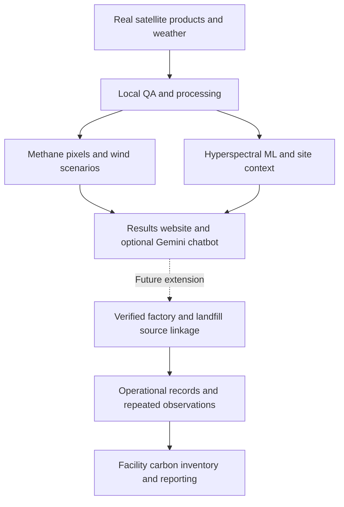
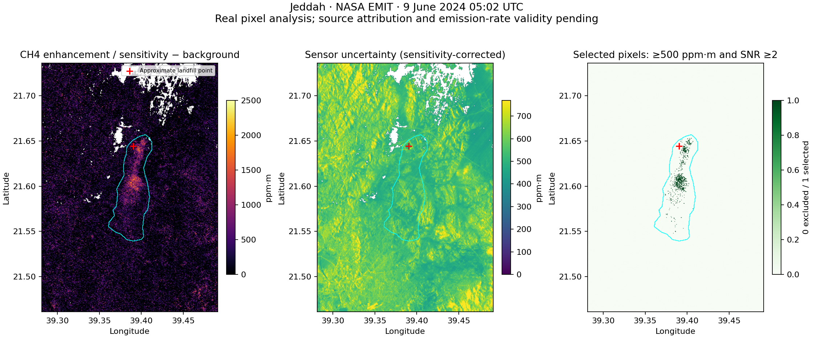
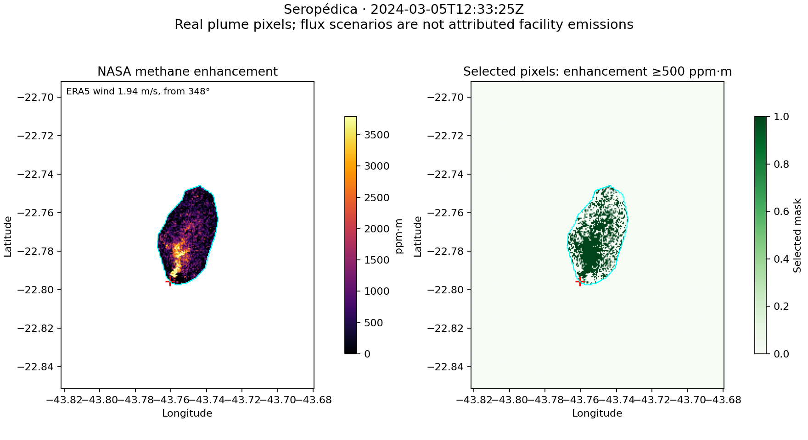
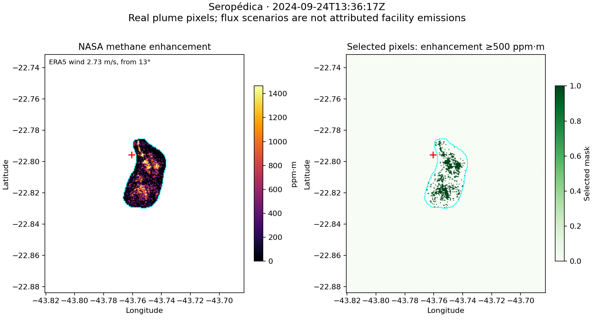
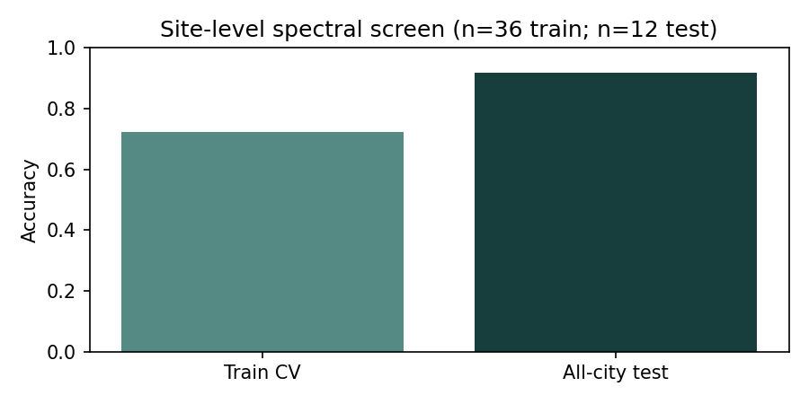

# EcoOrbit: methane and carbon intelligence

**Team:** EcoOrbit  
**Challenge / theme:** Air Intelligence  
**Country representation:** United Arab Emirates

EcoOrbit is an Earth-observation proof of concept that analyzes real NASA EMIT methane plume pixels near landfills, combines them with wind, and presents traceable evidence alongside carbon reporting and supplementary site analysis.

## PoC framework: completed work and future solution



**Completed:** three real EMIT methane observations, provider/local preprocessing documentation, pixel selection and excess mass, wind-based diagnostic scenarios, Tanager site screening, supporting multispectral/thermal and relevant NO2/SO2 context, and interactive evidence outputs. Provider preprocessing takes place before download. EcoOrbit performs further QA and analysis locally. The core pixel and ML results can be reproduced from the bundled real inputs. Supporting remote layers are included as committed results.

**Future:** verified factory/landfill attribution, dedicated landfill and green-site training labels, stronger plume wind and uncertainty validation, repeated gas measurements, site-specific CO2 evidence, activity ledgers and reporting-period GRI/GHG inventories, external user trials and Satellite 813 integration. Reporting depends on connecting observations to verified facilities and operational records.

## Evidence against the judging criteria

This mapping follows the supplied scoring image. It documents evidence rather than predicting a score. The image emphasizes quality of space data use and states that technical feasibility and space data quality break ties.

| Scoring criterion | EcoOrbit evidence | Scope / next step |
|---|---|---|
| **Quality of space data use** | NASA EMIT hyperspectral CH4 pixels underpin mask selection and methane mass. Tanager narrow-band reflectance supplies spectral features and site ML. Sentinel-2/Landsat provide contextual examples. Exact IDs, dates, processing levels, QA and provider/local responsibilities appear below. | Provider gas retrievals are the input. EcoOrbit performs downstream pixel analysis. Source attribution and complete uncertainty need further evidence. |
| **Team strength and expertise** | The delivered project demonstrates Python development, geospatial QA, hyperspectral feature extraction, ML evaluation, result presentation and documentation. The author, team member and mentor reviewed the PoC. | Registered names and individual contributions must match actual team records. No unconfirmed credentials or individual assignments are claimed. |
| **Problem relevance and impact** | Factory/landfill operators, environmental analysts and sustainability teams need interpretable gas observations. The Jeddah example establishes a regional case alongside Brazilian observations. | Intended impact is better prioritization of investigation and traceable evidence. No measured emissions reduction, cost savings or assured inventory is claimed. |
| **Innovation** | A reproducible workflow connects retrieved gas pixels, weather, transparent threshold scenarios and source files to an interactive interface. Hyperspectral site screening offers a future route to connect pollutant evidence with candidate industrial locations. | This is workflow integration and interpretability. The PoC does not claim to invent NASA's gas retrieval or establish superiority over all existing tools. |
| **Feasibility** | Bundled real gas inputs and spectral features support the offline reviewer commands. Outputs include tables, masks, figures and a static website. No GPU or Earthdata login is required for the bundled path. | Remote refreshes need network access and full scenes. Current source linkage, new-region ML and reporting boundaries still need validation. |

### Bonus evidence

| Bonus in the scoring image | Current evidence | Accurate boundary |
|---|---|---|
| Progress beyond the PoC | Working results website, Streamlit app, optional Gemini explanation, reusable exports and three real gas case analyses. | Working features exist. A production deployment or external operational pilot is not documented. |
| Hyperspectral data | Real EMIT methane retrievals and Tanager spectral features. Narrow-band observations enable gas enhancement inputs and material-pattern screening beyond broadband context alone. | No hyperspectral-versus-multispectral ablation is bundled. The project does not claim a measured comparative accuracy gain. |
| User validation: contact with at least three real users or stakeholders | Three-person PoC review confirmed by the project author: the author, one EcoOrbit team member and the mentor. Mentor advice led to the methane/carbon focus and clearer methodology. | Two reviewers belong to the project team. This records internal/stakeholder review, not three independent customer interviews or scientific validation. The organizers determine bonus eligibility. |


## 1. Business use case

Environmental analysts, factory and landfill operators, and sustainability teams need to decide which sites warrant investigation and which observations can support a disclosure. They currently combine satellite portals, spreadsheets and operational records manually. EcoOrbit brings plume pixels, acquisition times, quality rules and weather into one view, with exported evidence for follow-up.

The delivered solution includes a self-contained results website, a Streamlit dashboard and an optional Gemini assistant that explains packaged project evidence. An API key is required only for chat.

## 2. Problem

A satellite enhancement map does not directly establish a facility's emission rate or reporting-period carbon inventory. Clouds, noise, coarse winds, multiple sources and inconsistent sampling can change the interpretation. Analysts need reproducible processing and visible evidence limits before attributing gas to a factory or landfill.

Hyperspectral observations supply narrow-band gas retrievals and material signatures. Multispectral imagery supplies vegetation, built-surface and thermal context. This PoC uses actual Saudi, Brazilian and US observations. It has no synthetic measurements. Satellite 813 is a future integration target, not a current input.

## 3. Data used

| Dataset / provider | Actual dates and processing level | Included material and use | Licence / attribution |
|---|---|---|---|
| NASA/JPL EMIT, LP DAAC | L2B V002 CH4; Jeddah 2024-06-09; Seropédica 2024-03-05 and 2024-09-24 | Real CH4PLM TIFFs and GeoJSON metadata. Jeddah also has spatial crops of CH4ENH, CH4UNCERT and CH4SENS. Pixel methane analysis. | NASA/LP DAAC product terms and citation. MIT covers code, not third-party data. |
| Planet Tanager core imagery | Orthorectified L2A surface reflectance; Jacksonville 2025-05-16, Rochester 2025-08-01, Detroit 2025-09-14 | Measured spectral features from 48 sites, derived material-class grid and figures. Full HDF5 scenes excluded. | Public scene terms in Planet STAC; credit Planet and verify scene-specific redistribution terms. |
| Copernicus Sentinel-2 via Microsoft Planetary Computer | L2A; paired examples 2025-02-26/2025-06-01 in Jacksonville and 2025-06-02/2025-09-28 in Detroit | Derived B04/B08/B11 NDVI and NDBI tables. Eight sites have paired observations. Ancillary AOT outputs also exist. | Copernicus Sentinel data terms; credit ESA/Copernicus and the access platform. |
| USGS/NASA Landsat 8/9 via Planetary Computer | Collection 2 L2 surface temperature; 2025-05-15, 05-22, 08-11, 09-03, 09-17 and 10-03 | 38 QA-valid site/date rows across 19 industrial sites. | USGS public-domain Landsat data and required source credit. |
| Copernicus Sentinel-5P/TROPOMI | L2 NO2/SO2, observed Detroit 2025-09-14; regional CH4 examples Jacksonville 2025-05-16 and Detroit 2025-09-14 | QA-screened atmospheric columns. NO2/SO2 values exist at eight Detroit sites per product. | Copernicus Sentinel data terms. Coarse columns do not identify stack emissions. |
| ECMWF/Copernicus ERA5 via Open-Meteo | Historical reanalysis for each 2024 EMIT observation and the three US 2025 image weeks | Cached real wind, pressure and temperature responses; 504 US hourly wind rows. | Attribute ERA5/ECMWF/Copernicus and Open-Meteo; see linked service terms. |
| CAMS via Open-Meteo | Regional modeled NO2/SO2 context for US image weeks | Optional modeled concentration summaries, separate from satellite columns. | Copernicus CAMS and Open-Meteo terms. |
| US EPA FRS TRI; OpenStreetMap | Registry/source snapshots bundled; these are site-label proxies, not a verified current operating inventory | 24 industrial and 24 school comparison points across three US cities; additional candidates remain unvalidated. | EPA source credit; OSM contributors and ODbL. |
| Carbon Mapper published examples | Tanager CH4 at Seropédica 2024-09-29; Tanager CO2 at Singrauli 2024-11-01; EMIT CH4 example 2024-04-20 | Three source-reported reference records with URLs, separate from EcoOrbit's NASA pixel calculations. | Carbon Mapper terms and attribution, described in `docs/DATA_ATTRIBUTION.md`. |

OCO-2/3 XCO2 parsers and NASA catalog discovery are optional code paths. No OCO measurements or landfill CO2 retrieval are bundled. The reported Singrauli CO2 rate is a published example at a different site, not an EcoOrbit calculation.

**Exact bundled EMIT plume IDs:**

| Case | NASA granule ID | Acquisition UTC |
|---|---|---|
| Jeddah | `EMIT_L2B_CH4PLM_002_20240609T050226_003220` | 2024-06-09 05:02:26 |
| Seropédica, March | `EMIT_L2B_CH4PLM_002_20240305T123325_002889` | 2024-03-05 12:33:25 |
| Seropédica, September | `EMIT_L2B_CH4PLM_002_20240924T133617_003564` | 2024-09-24 13:36:17 |

Exact Tanager scene IDs are `20250516_164837_16_4001`, `20250801_165548_86_4001` and `20250914_171527_18_4001`. The register `data/training_sites.csv` maps each site to its scene. Source scene IDs, dates and provenance for supporting analyses are retained in their result CSVs.

## 4. Technical approach

### Where preprocessing happens

Provider processing happens **before download**. EcoOrbit's Python processing happens **locally on your machine**, in the project modules shown below. The packaged source crops and derived tables allow offline reproduction without full-scene downloads.

| Stage | Provider processing already in the input | EcoOrbit's implemented operation / location |
|---|---|---|
| Radiometric calibration | Providers convert instrument measurements to calibrated products. | Reads delivered values; does not calibrate raw sensor counts. Landsat temperature DN scaling occurs in `src/site_heat.py`. |
| Atmospheric correction / retrieval | Planet Tanager L2A supplies surface reflectance. Sentinel-2 L2A supplies atmospherically corrected reflectance. NASA supplies EMIT gas enhancement retrievals. | Does not rerun provider atmospheric correction or a radiance matched filter. Jeddah sensitivity and background operations refine delivered retrievals in `src/emit_pixels.py`. |
| Geometric correction | Planet ortho imagery and delivered NASA GeoTIFFs already contain georeferencing. | Maps site coordinates into source CRS, checks companion grids, clips polygons and samples local grids. Uses WGS84 geodesic cell areas and UTM for plume span. |
| Spectral binning | Tanager retains narrow-band reflectance with wavelengths. | `src/train_classifier.py`: 30 nm bins over 450–2400 nm, excluding centres in 1350–1450 and 1800–1950 nm. Produces 57 spectral bins plus NDVI/NDBI/MNDWI. |
| Quality screening | Providers supply cloud, cirrus, no-data and retrieval quality layers. | Tanager: mask no-data/cloud/cirrus, valid centre and ≥50 valid pixels in 11×11 neighbourhood. Sentinel-2: SCL 4/5/7. Landsat: QA_PIXEL bits. TROPOMI: NO2 QA >0.75, SO2 QA >0.50. |


### Methane processing, in execution order

1. Read the three real plume TIFFs, metadata and cached ERA5 weather in `data/real_emit/`.
2. **Jeddah:** validate companion grids, divide ENH by SENS, accept sensitivity 0.5–2 and positive uncertainty, subtract the median surrounding-crop background, then require enhancement ≥ threshold and ≥2× uncertainty inside NASA's polygon. UNCERT already includes sensitivity correction and is not divided again.
3. **Brazil:** select finite plume enhancement pixels inside NASA's polygon. ENH/UNCERT/SENS companions are absent, so the code applies no companion correction, surrounding-scene background estimate or uncertainty screen.
4. Evaluate 500/1000/1500 ppm·m thresholds. Calculate each WGS84 pixel area. Convert enhancement to methane column mass using the ideal gas law with recorded pressure and temperature, then sum selected excess mass.
5. Match real ERA5 wind: nearest 05:00 UTC hour for Jeddah; interpolate adjacent hourly wind components for Brazil. Estimate whole-complex span in UTM and calculate diagnostic `Q = 3600 × wind × excess mass / span`.
6. Write pixel tables, masks, threshold scenarios, figures and JSON provenance. Build the interactive website from these outputs.

### Supporting ML and multispectral analysis

- **Future use of site screening:** the current spectral classifier demonstrates a way to prioritize candidate factory locations for plume investigation. Linking these locations to verified source boundaries could support future facility reporting. Dedicated landfill labels and operational evidence are required before that extension.
- **Supervised contextual classifier:** `src/evaluate_sites.py` uses median imputation, standardization, PCA and balanced logistic regression (`C=0.1`). Fixed seed 813. The 75/25 split is stratified by city and label: 36 train / 12 test, with four test sites in each city. Three-fold training-only validation selects 4/8/12 PCA components. The selected model uses eight.
- **Material clustering:** `src/pipeline.py` spatially samples Tanager at stride 2, bins reflectance, fits seven MiniBatchKMeans groups with up to 20,000 training pixels, and assigns provisional vegetation/water/built-or-bare names using indices. This is not validated parcel land-use mapping.
- **Multispectral context:** `src/site_land.py` compares Sentinel-2 NDVI/NDBI in a 180 m site circle and 500–1000 m reference ring. It currently calculates ratios from delivered band values without explicitly applying metadata scale/offset. This is a limitation for newer Sentinel-2 processing baselines and should be verified before quantitative change claims.
- **Thermal context:** `src/site_heat.py` applies `ST_K = DN × 0.00341802 + 149`, then subtracts 273.15. It compares a 180 m site circle with a 600–1200 m reference ring. Surface heat is not a gas concentration.
- **Relevant NO2/SO2:** `src/site_pollutants.py` returns the nearest QA-valid column pixel centre within 15 km. Values represent atmospheric columns, not facility emission rates or surface exposure.
- **Green comparison:** 12 spatially separated image patches show vegetation context in Jacksonville. They are not verified independent parks or supervised classifier negatives.
- **Future facility reporting:** GRI 305 / GHG Protocol evidence mapping separates satellite observations from an activity-based inventory. Fuel/electricity activity, factors and reporting boundaries are required for Scope 1/2 totals. Diagnostic plume flux is excluded.
- **Optional assistant:** `dashboard.py` supplies packaged result excerpts and methodology to Gemini. Prompt instructions request project-only, source-grounded answers in English or Arabic. Prompt rules are not a verified guarantee against hallucinations.

## 5. Installation

Requires **Python 3.11**. Use your cloned repository folder containing this README, `src/` and `requirements.txt`. All commands below are terminal commands, without a notebook `!` prefix.

**Recommended on Mac with Conda**, especially when pip cannot find a compatible Rasterio wheel:

```bash
conda create -n ecoorbit -c conda-forge python=3.11 pip rasterio=1.4.3
conda activate ecoorbit
python -m pip install -r requirements.txt
python -m pip check
python -c "import numpy, pandas, rasterio; print('Dependencies working')"
```

**Alternative virtual environment on a supported platform:**

```bash
python3.11 -m venv .venv
source .venv/bin/activate
python -m pip install -r requirements.txt
```

Windows PowerShell activation: `.venv\Scripts\Activate.ps1`. If Rasterio requests `gdal-config`, use the Conda route instead of attempting an unconfigured source build. Stop after an installation error before running later commands.

Remote downloads are optional: `python -m pip install -r requirements-remote.txt`. No account, token or API key is needed for the bundled reviewer path. GPU not required.

## 6. How to run

### Reviewer path: reproduce the real outputs

Run from the repository root:

```bash
python -m src.emit_cases
python -m src.evaluate_sites
python -m src.import_methane_plumes --published
python -m src.build_website
```

This reproduces the three methane cases, the site classifier and the website from included real inputs. Allow several minutes on a typical laptop; runtime depends on environment and image rendering and is not a benchmark. Outputs appear in `results/real/emit_pixels/`, `results/real/classifier/` and `EcoOrbit_Results_Website.html`. 

### Required Jupyter notebooks

```bash
python -m jupyterlab notebooks/02_main_analysis.ipynb
```

Select the installed EcoOrbit environment, restart the kernel, then Run All. This notebook evaluates the included Tanager features and displays supporting committed outputs. For the three methane pixel cases, also run `notebooks/04_emit_pixel_analysis.ipynb`.

For an explicit Conda kernel:

```bash
python -m ipykernel install --user --name ecoorbit --display-name "Python (EcoOrbit)"
```

To execute the main notebook from the terminal using this kernel:

```bash
python -m nbconvert --to notebook --execute notebooks/02_main_analysis.ipynb --ExecutePreprocessor.kernel_name=ecoorbit --output 02_main_executed.ipynb
```

Commit notebook outputs after your own clean restart-and-run test. Committed outputs are supplied; this README does not certify a clean-machine execution or the organizer's automated validation result.

### Website and app

Open `EcoOrbit_Results_Website.html` directly in a browser. It provides Solution, Methodology and Additional Features pages. GitHub's source viewer does not render the HTML as a live website.

```bash
python -m streamlit run dashboard.py
```

Open the URL printed by Streamlit. The Streamlit app and static website are separate interfaces with different layouts. The packaged static pixel view uses coordinate graphics; do not assume it includes an aerial basemap.

Chat is optional. Paste your own Gemini key into the app's password field or set `GEMINI_API_KEY` locally. Core analysis and results tabs work without it. User questions, chat history and packaged evidence excerpts are sent to Google's service when chat is used. Do not commit secrets or submit confidential data to the assistant.

### Optional raw-scene refresh

```bash
python -m src.multisite_download
python -m src.train_classifier
python -m src.evaluate_sites
python -m src.site_heat
python -m src.site_land
python -m src.site_pollutants
```

Tanager full scenes are large and saved under `data/cache/`. `src/train_classifier` re-extracts spectra and also writes a legacy city-holdout result; rerun `src.evaluate_sites` afterwards for the primary all-city test. Remote availability, QA and exact scene selection can affect coverage. Use [GitHub setup](docs/GITHUB_SETUP.md) and [data attribution](docs/DATA_ATTRIBUTION.md) for optional downloads. Satellite credentials and full scenes should remain outside GitHub.

## 7. Example input and output

Real, compact classifier input: `data/sample_input/tanager_site_features_real.csv`. The evaluator currently reads the matching source table at `results/real/classifier/site_spectral_features.csv`, not the convenience copy in `sample_input`.

Real gas inputs: `data/real_emit/jeddah_20240609/`, `seropedica_20240305/` and `seropedica_20240924/`. Original product filenames and GeoJSON metadata identify each observation. Jeddah companion rasters are spatial crops retaining provider pixel values and georeferencing.

**Jeddah enhancement, uncertainty and selected mask:**



**Brazil: measured methane enhancement and selected pixels:**





**Supplementary all-city classifier evaluation:**



## 8. Results and limitations

The following values are from the committed `case_summaries.json`, at 500 ppm·m. They are analysis outputs, not independently validated facility emissions.

| Observation | Selected pixels | Selected excess CH4 mass, kg | ERA5 wind, m/s | Diagnostic whole-complex flux, kg/h |
|---|---:|---:|---:|---:|
| Jeddah, 2024-06-09 | 812 | 2,219.7 | 1.14 | 768.3 |
| Seropédica, 2024-03-05 | 2,084 | 6,413.2 | 1.94 | 7,764.0 |
| Seropédica, 2024-09-24 | 747 | 1,399.1 | 2.73 | 2,885.1 |

- Pixel enhancement is **ppm·m**. Integrated excess mass is **kg at an observation time**. Diagnostic flux is **kg/h under assumptions**. Reporting-period inventory is **tCO2e** and requires additional evidence.
- NASA supplies the hyperspectral gas retrieval. EcoOrbit has not retrieved methane directly from radiance, independently validated plume detection, or verified a landfill source origin.
- Whole-complex flux assumes suitable winds and a steady localized source. Coarse 10 m ERA5 winds, extended/multiple sources and mask selection can break those assumptions. Jeddah's partial assumed uncertainty is about 1,011 kg/h, larger than its 768 kg/h diagnostic estimate. It omits several systematic errors.
- Brazil lacks uncertainty/sensitivity companions and a surrounding-scene background estimate. Jeddah and Brazil mass/flux results use different processing. The two Brazilian dates do not establish a reduction in emissions.
- The supervised test correctly classifies **11/12 sites (91.7%), AUC 0.944**. Six industrial test sites are correct and one school control is misclassified. It tests industrial-versus-school spectral context, not universal factory/landfill parcel classification or gas attribution. Schools supply built-environment controls, not proof of pollution effects.
- Green patches illustrate vegetation contrast. New green/commercial supervised classes have acquisition code but no bundled evaluated results.
- The Sentinel-2 reflectance-offset limitation affects interpretation of its index changes. Clouds, limited dates, mixed spatial support and incomplete coverage further limit supporting analyses.
- CO2 at the two landfills is not measured by this package. A catalog query finding no CO2 match does not mean zero emissions. Published CO2 evidence at another site is explicitly separate.
- GRI 305 / GHG Protocol mapping is an evidence assessment, not legal compliance or an assured inventory. No fuel/electricity ledger is supplied, and no annual emissions are calculated.

## 9. Team, licence and attribution

Team **EcoOrbit**, challenge **Air Intelligence**, country representation **United Arab Emirates**. 

| Registered member | Experience |
|---|---|
| Yahya Kanjo | Python-based data science, machine learning and AI, Agentic AI, LLM and Chatbot Development, Data Engineering, Interactive dashboard development |
| Zina Abohaia | Earth observation and Remote Sensing, Spectral image analysis, GIS and geospatial analytics, Machine learning and AI, Data Science, ESG and Sustainability Analytics |

The MIT [LICENSE](LICENSE) covers project code only. Third-party data keep their original terms. Credit NASA/JPL/LP DAAC, Planet, ESA/Copernicus, USGS, ECMWF, Open-Meteo, Microsoft Planetary Computer, EPA, OpenStreetMap contributors, Carbon Mapper and the organizer's example notebooks. Detailed provider links are in [DATA_ATTRIBUTION](docs/DATA_ATTRIBUTION.md).


