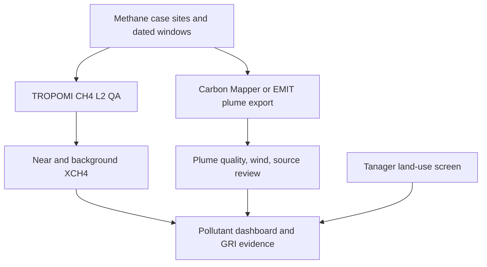

# EcoOrbit methodology: methane and carbon intelligence

The judge-facing website has three pages: Solution, Methodology, Additional features. Primary evidence is NASA methane plume pixels from three observed events, real ERA5 wind, selected excess mass and diagnostic flux. Carbon is separate source-reported CO2 reference evidence; there is no new landfill CO2 retrieval or annual inventory. NO2/SO2, hyperspectral site ML and multispectral land/heat are supplementary context.

The detailed implemented gas pipeline is in `EMIT_PIXEL_METHOD.md`. The concise full-stage judge report is `methodology_report.pdf`. Website stage descriptions are generated in `src/judge_pages.py`, and identify provider preprocessing separately from actual EcoOrbit operations.

## Study boundary

Pollutant intelligence is primary. Four CH4 case locations are registered: a Stanford controlled-release experiment near Casa Grande (verified 2022 experiment coordinates), the Hassi R'Mel gas-field region (approximate coordinate), Wadi Al-Asla landfill near Jeddah, and CTR Santa Rosa landfill in Seropedica (published landfill coordinate). The 2024 Jeddah dates now coincide with nearby NASA EMIT V002 CH4 plume-complex catalog records, although their source remains unverified; the Stanford 2024–25 release claim is unverified. The included real US TROPOMI CH4 regional columns demonstrate available observations but do not cover those three cases. The 24 industrial and 24 school Tanager site spectra are retained as an **additional** land-use screen; green scene patches are a supplementary comparison. Five NASA EMIT V002 CH4 plume-complex granules are catalogued near the Jeddah and Seropedica landfill points; no landfill release rate is claimed.

## Pipeline diagram

## NASA EMIT V002 landfill plume pathway

`src/landfill_gases.py` searches NASA CMR for `EMITL2BCH4PLM` and `EMITL2BCO2PLM` V002 with geographic bounding boxes around Wadi Al-Asla (21.644194, 39.390260) and CTR Santa Rosa (-22.795703, -43.760558). It preserves granule IDs, NASA CMR concept IDs, data links and footprint polygon coordinates. It computes the nearest geodesic distance between each polygon and approximate landfill point. In the 2024-2025 catalog search, Jeddah has CH4 granules on 26 February, 9 June and 15 October 2024 at 0.611, 0 and 1.115 km; Seropedica has 5 March and 24 September 2024 at 0 and 0.277 km. No intersecting EMIT CO2 plume complex was returned for these two bounding boxes. NASA's L2B plume complexes are reviewed products, but a nearby catalog footprint does not prove landfill origin. Download with personal Earthdata authentication to inspect the full GeoJSON plume outline, COG enhancement and browse image; examine wind, nearby sources and actual landfill boundary. No rate is calculated from footprint proximity.

For regional CO2, the optional NASA OCO-2/3 Lite NetCDF parser quality screens `xco2_quality_flag == 0` and requires at least three observations within 25 km and three in a 25-80 km reference ring before computing a difference in ppm. There is no bundled OCO landfill file, so no local XCO2 number is claimed. Regional Sentinel-5P CH4 uses the parallel QA-screened 25 km/ring method. Neither regional contrast is landfill-attributed. See NASA [EMIT L2B guide](https://github.com/emit-sds/emit-sds-tgp/blob/develop/docs/EMIT_L2B_TRACE_GAS_User_Guide.md) and [OCO-3 Data Center](https://ocov3.jpl.nasa.gov/science/oco-3-data-center/).

## CH4 measurement and provenance

`src/methane_cases.py` searches Sentinel-5P L2 NetCDF, downloads actual CH4 orbits, reads bias-corrected XCH4 in ppb, accepts `qa_value > 0.5` and physically plausible 1000–3000 ppb, then compares pixels 0–25 km from the location with 25–80 km background pixels. At least three QA-valid pixels in each region are required for a reported near-minus-background contrast. Granule ID, date, pixel counts and statuses are preserved. A positive regional contrast does not establish a plume or emission rate and does not validate the proposed date. Missing scenes and failed downloads are explicit statuses, never zero.

`src/import_methane_plumes.py` reads a real Carbon Mapper CSV or GeoJSON export, retains CH4 plume ID, acquisition time, sensor, quality, wind, emission estimate and uncertainty, and lists records whose origins are within 20 km of a case point. Spatial proximity is a candidate match, not attribution. Review original image, wind direction, plume geometry, source equipment and repeat observations. Instantaneous kg/h must not be multiplied by an entire year without measured persistence. The optional EMIT V2 plume product is available via NASA Earthdata; V1 distribution was retired in 2026. The existing Tanager scenes are surface-reflectance land classification, not a methane retrieval at the three case locations.

| Case | Coordinates | Time and confidence |
|---|---|---|
| Stanford controlled-release, Arizona | 32.8218205, -111.7857730 | Controlled release experiment documented Oct–Nov 2022. Proposed Aug 2024–Dec 2025 releases unverified. |
| Hassi R'Mel gas field, Algeria | about 32.9, 3.2 | Published 2020 methane study, approximate field center rather than a specific compressor stack. |
| Wadi Al-Asla landfill, Jeddah | about 21.644194, 39.390260 | Landfill location documented; EMIT CH4 plume-complex granules exist near the point on Feb 26, Jun 9 and Oct 15 2024; the landfill source is not verified. |

## Additional factory and landfill classification

The included Tanager classifier is a weak factory-versus-school screen, not a landfill classifier. To train factory/landfill/other classes, obtain clear hyperspectral images **over each registered methane site**, verified site polygons and independent examples of landfills, industrial sites and other urban/green cover; split by site across all geographic areas before reporting accuracy. Do not relabel a methane plume as a landfill land-use observation.

## Inputs and correction stages

| Data | Processing and units | Role |
|---|---|---|
| Planet Tanager L2A, three 2025 HDF5 scenes | Provider radiometric calibration, atmospheric correction and orthorectification already applied; read surface reflectance, HDF cloud/cirrus/no-data masks; exclude 1350-1450 and 1800-1950 nm absorption ranges; average bands in 30 nm bins | Spectral site screen, not an independent emissions observation |
| EPA FRS TRI records and OSM schools | Snapshotted source JSON; 24 industrial and 24 school points, eight of each per city; clear center pixel and at least half of the 150 m neighborhood valid | Weak site labels; no roof polygons or operating-state validation |
| Landsat 8/9 Collection 2 L2 | Surface temperature in degrees C = DN x 0.00341802 + 149 - 273.15; mask QA_PIXEL fill, dilated cloud, cirrus, cloud, shadow, snow and water. Read the provider's Level-2 atmospheric and geometric processing; do not reapply it | Site surface temperature versus surrounding land |
| Sentinel-2 MSI L2A | Provider surface reflectance; read B04 red, B08 NIR, B11 SWIR and SCL. Retain SCL classes 4, 5 and 7, require positive band values | Two-date NDVI and NDBI |
| Sentinel-5P TROPOMI L2 NetCDF | Read tropospheric NO2 and total SO2 columns in mol/m2; apply scaled `qa_value > 0.75` and `> 0.50` respectively | Coarse atmospheric context at nearest valid pixel center |
| CAMS model and ERA5 reanalysis | Hourly model NO2, SO2 and 10 m wind around each city | Regional context and directional screening; not facility measurements |

The earlier Sentinel-2 AOT and UV aerosol-index files remain as optional regional context. Sentinel-5P methane is now a primary regional pollutant observation. None is used as a factory emission label. The code does **not** contain a sensor-specific raw radiometric calibration for Satellite 813. If that sensor becomes available as L1 imagery, its published dark-current, gain/offset, wavelength, atmospheric and georeferencing calibration must be implemented before the common reflectance stage. Do not apply a Tanager calibration coefficient to Satellite 813.

## Hyperspectral classifier

For each point, `src/train_classifier.py` extracts reflectance medians from an approximately 150 m, 11 x 11 source-pixel neighborhood, yielding 57 spectral bins and NDVI, NDBI and MNDWI (60 features). The primary evaluation uses a fixed 75/25 stratified site split: 36 training and 12 test sites, with two points per class from every city in the test set. PCA components (4, 8 or 12) are selected by three-fold cross-validation on training sites only; imputation, scaling and PCA are fit within each fold. The selected eight-component logistic pipeline is then fit on 36 sites and scored once on the untouched 12. A separate full-data model supplies exploratory dashboard scores. The negative class consists solely of mapped schools; the model has not learned all nonfactory land uses.

| Test set | Industrial | School | Accuracy | ROC AUC |
|---|---:|---:|---:|---:|
| All-city site split | 6 | 6 | 0.917 | 0.944 |

Primary test confusion matrix (rows true school/industrial; columns predicted school/industrial): `[[5,1],[0,6]]`; accuracy **11/12 = 0.917**, ROC AUC **0.944**. Each city contributes two points from each class. This small test is not an estimate of accuracy for arbitrary nonindustrial land uses. The earlier whole-city holdout (0.750 accuracy, 0.804 pooled AUC) is a separate, harder transfer check, not an improvement comparison.

## Heat and land-change methods

`src/site_heat.py` searches clear Landsat scenes near each hyperspectral date and uses a 30 m **output grid**; Landsat thermal measurement information is coarser than that grid. It reports the median surface temperature inside 180 m of a factory point and a 600-1200 m annulus on the **same scene date**. `surface_excess_c = site median - reference median`. At least 10 site and 100 reference valid grid cells are required. Roofs, pavement, vegetation, shading, land-cover mix and weather confound this difference, which is not waste-heat flux or air temperature.

`src/site_land.py` selects one low-cloud Sentinel-2 scene in each of two city-specific seasonal windows. It uses a 180 m site circle and a 500-1000 m reference annulus. `NDVI = (B08 - B04)/(B08 + B04)` and `NDBI = (B11 - B08)/(B11 + B08)`. It records both dates and `later - earlier` only when both sites have valid data. The selected dates are not strictly phenology-matched, and changes can reflect seasonal conditions rather than factory activity.

| Observed coverage | Detroit | Jacksonville | Rochester | Total |
|---|---:|---:|---:|---:|
| Landsat distinct sites | 3 | 8 | 8 | 19 |
| Landsat valid site-date rows | 6 | 16 | 16 | 38 |
| Sentinel-2 paired land-change sites | 2 | 6 | 0 | 8 |

The Landsat site-minus-reference median across site-date rows is +0.66 C in Detroit, +1.45 C in Jacksonville and +4.00 C in Rochester. These are on different dates and backgrounds; comparing them as facility heat emissions would be unsound. Rochester's selected Sentinel-2 scenes produced no valid site pixels; no change is inferred. See `scene_coverage.csv` for each source scene and missing count.

## Pollutant, wind and uncertainty method

`src/site_pollutants.py` associates each facility coordinate with its **nearest QA-valid pixel center** within 15 km, preserving the pixel-center coordinates, center distance, QA, scene ID and NO2/SO2 atmospheric column. This is a spatial lookup into a multi-kilometre footprint, not a stack measurement or proof that the point lies alone inside that footprint. Several plants may share a pixel value. Atmospheric columns are not ground-level concentrations and cannot be converted to facility emission rates without transport modeling, inventories and independent observations. Near-background SO2 retrievals can be negative due to noise; the code retains those values, never calls them negative emissions. ERA5 10 m wind adds regional direction but cannot resolve stack-height flow or plume attribution.

The included observed NO2 and SO2 files cover eight Detroit points on 14 September 2025. Rochester has no NO2/SO2 catalog items in the queried 1-9 August image-week. The Jacksonville full-orbit NetCDF download did not finish; its 16 product/site entries say `download pending`. On another machine, run `python -m src.site_pollutants --city Jacksonville --product no2`, then repeat with `--product so2`. The revised downloader uses resumable 8 MiB range parts. The script retains completed city/product rows when one subset is refreshed. Do not interpret missing or pending entries as zeros.

## Dashboard and ESG evidence

The Streamlit dashboard leads with the CH4 case register, observation status and measured US regional CH4 context, then maps all 24 registered factory points and shows the all-city site classifier scores, valid heat/land rows, NO2/SO2 status and pixel-center distances, legacy aerosol/methane context, CAMS and ERA5 series, and a downloadable ESG evidence report. This is an **evidence-readiness** report. Scope 1/2 emissions and compliance with UAE law are **not assessed**. For a Fujairah deployment, obtain verified factory parcel/stack coordinates, dated operations, fuel and electricity records, source-specific factors, ground/stack monitoring, applicable UAE and emirate permits, and suitable coincident imagery. Rebuild training labels and hold out independent local sites before using model scores operationally.

### Sources and provenance

- [Planet Tanager documentation](https://docs.planet.com/data/imagery/tanager/); exact item IDs, HDF5 URLs and checks in code and output CSVs.
- [EPA FRS API](https://www.epa.gov/frs/frs-api); source JSON snapshots in `data/source_snapshots/`. School data © OpenStreetMap contributors, ODbL.
- [USGS Landsat Collection 2 surface temperature](https://www.usgs.gov/landsat-missions/landsat-collection-2-surface-temperature).
- [Microsoft Planetary Computer Sentinel-2 and Sentinel-5P collections](https://planetarycomputer.microsoft.com/catalog).
- [Copernicus NO2 product readme](https://sentinels.copernicus.eu/documents/247904/3541451/Sentinel-5P-Nitrogen-Dioxide-Level-2-Product-Readme-File) and [SO2 product readme](https://sentinels.copernicus.eu/documents/247904/3541451/Sentinel-5P-Sulphur-Dioxide-Readme.pdf).
- [Open-Meteo air-quality API](https://open-meteo.com/en/docs/air-quality-api) and [historical weather API](https://open-meteo.com/en/docs/historical-weather-api).

## Candidate expansion and label contribution

The saved EPA FRS queries yield **424 additional registry candidates** within the three Tanager bounding boxes (Detroit 236, Jacksonville 69, Rochester 119). They are published in `data/candidate_factories.csv` with status `candidate_only_needs_image_QA_geometry_and_operating_check` and excluded from training and accuracy claims. Source HDF5 imagery is not bundled, so there is no observed spectral feature for these points. Schools serve only as mapped, built-up negative controls; their inclusion tests separation from this particular land use and can inflate apparent performance relative to a realistic mix. For new training, inspect active operations and parcels, extract clear spectra, and add verified residential, commercial, road, port and green-space controls. Rebuild a fresh independent test split after adding verified examples.

## International disclosure demonstration

`results/real/esg_gri305_evidence.md` maps observations to [GRI 305: Emissions 2016](https://www.globalreporting.org/publications/documents/english/gri-305-emissions-2016/) disclosures 305-1 (direct GHG), 305-2 (energy indirect GHG), and 305-7 (NOx/SOx and other significant air emissions), with the [GHG Protocol Corporate Standard](https://ghgprotocol.org/corporate-standard) for Scope 1/2 accounting. The satellite heat, vegetation, wind and atmospheric columns are screening context. None directly measures a site's tCO2e or NOx/SOx mass. Fuel/process and purchased energy ledgers, emission factors, organizational boundary, stack or ground measurement and uncertainty are missing. The deliverable is an explicit evidence-gap assessment, not a claim of GRI conformity.

## Additional real comparison classes (pending imagery)

`src/add_control_sites.py --fetch` retrieves OSM polygon geometry for parks, grass/forest/recreation areas, and commercial/retail/office areas within each Tanager footprint. It uses an interior polygon point rather than an arbitrary coordinate; approximate interior clearance is at least 90 m for green space and 20 m for commercial property. `--extract` then checks separation (650 m from already selected sites) and the source scene's cloud, cirrus and nodata masks, extracting the same 60 features for up to four green and four commercial sites per city. A second all-city stratified test is produced only after real source spectra exist. Green areas test vegetation confounding; commercial areas test whether built-up fabric alone prompts a factory score. These comparisons may reveal false positives and change measured accuracy. OSM tags remain proxy labels, and a 150 m spectral neighborhood can cross parcel boundaries.

## Observed vegetation reference result

The archived Jacksonville Tanager L2A 60 m sampled classification grid (`classified_sample.npz`) provides real, quality-masked scene pixels. We find 5×5 sampled-cell image patches (about 300 m across) with at least 80% pixels in the highest-NDVI vegetation-like cluster, at least 95% valid pixels, and patch centers separated by at least 30 sampled cells (about 1.8 km). Twelve are mapped in `green_reference_map.png`. The *cluster-wide* NDVI median is 0.770 over 14,052 sampled pixels; eight Jacksonville factory-neighborhood median NDVIs have a median of 0.305 (difference +0.465). Cluster-wide statistics have different spatial support than site neighborhoods; do not interpret 12 selected patches as 12 independent NDVI replicates. Scene image row/column indices are included, while verified geographic park geometry is unavailable. This demonstrates spectral vegetation contrast, not exposure, emission attribution, a negative training class, or improved test accuracy.

## Methane case sources

- [Stanford controlled-release single-blind study](https://amt.copernicus.org/articles/17/765/2024/): Casa Grande site coordinates and Oct–Nov 2022 testing. It does not establish the proposed 2024–25 release period.
- [Hassi R'Mel / Hassi Messaoud 2020 analysis](https://pubmed.ncbi.nlm.nih.gov/37956986/): Sentinel-2 point sources plus TROPOMI transport inversion at the gas-field scale. The register's 32.9, 3.2 is approximate.
- [Wadi Al-Asla landfill study](https://pmc.ncbi.nlm.nih.gov/articles/PMC13024435/): approximate landfill coordinates. The separate NASA EMIT V002 CMR records now verify nearby plume-complex products on those dates; the landfill source is not established.
- [Carbon Mapper product guide](https://carbonmapper.org/articles/product-guide): plume quality, instantaneous rates, wind, uncertainty, scene coverage, and API/export. [NASA EMIT V2 availability notice](https://www.earthdata.nasa.gov/data/alerts-outages/emit-methane-carbon-dioxide-version-1-data-products-decommissioned).

## CO₂ and interactive results

A Carbon Mapper export can include `gas=CO2` alongside `CH4`. `src/import_methane_plumes.py` filters by gas, matches a plume origin within 20 km of a registered case, and keeps time, sensor, quality, wind, instantaneous gas-specific kg/h and uncertainty. The dashboard filters those records by gas, case and available dates. Satellite CO₂ plume retrievals are **not** an annual carbon footprint. NASA EMIT V2 separately distributes CO₂ plume-complex products; they require NASA Earthdata acquisition and review. No new case-specific CO₂ plume is bundled.

`src/carbon_results.py` runs only when `data/facility_activity.csv` is supplied. For each declared facility/period, Scope 1 tCO₂e = fuel/process quantity × documented kgCO₂e/unit / 1000; Scope 2 tCO₂e = purchased kWh × documented kgCO₂e/kWh / 1000. It rejects missing factor/activity provenance and missing records are not zero. It does not infer fuel quantities, methane GWP, organizational boundaries or annual persistence from satellite data. The template supports one aggregated fuel/process line per facility/period; multiple fuels, process gases and location-/market-based electricity factors require appropriately separate records and accounting controls before a conforming inventory can be claimed.

The interactive dashboard starts with case-specific CH₄/CO₂ evidence, then provides selectable NO₂, SO₂, aerosol index and AOT. TROPOMI and Sentinel-2 values are satellite observations with their stated spatial limitations. Carbon and GRI panels explicitly display whether a verified activity ledger is available.

## Included published plume observations

`data/published_plumes.csv` records three **real published** Carbon Mapper examples, with the source article, instrument, date/time, gas and exactly the rate basis stated in the source. It includes a Seropédica landfill CH4 plume (Tanager-1, 29 Sep 2024, preliminary 2,836 kg/h), a Singrauli electricity-generation CO2 plume (Tanager-1, 1 Nov 2024, preliminary source emission rate 838,000 kg/h), and the Carbon Mapper product-guide EMIT CH4 API example (20 Apr 2024, plume `emi20240420t101448p07050-A`, 3,610.58 ± 377.95 kg/h, wind 1.89 m/s). The first two example plume IDs and UTC time components come from the provider's published image filenames; exact origin coordinates and uncertainties are not stated in their article text. The example API record includes point coordinates and QA. These are **not** observations at Jeddah, Hassi R'Mel or the Stanford Arizona site and cannot validate their proposed dates. Published rate values are not reprocessed raw imagery; dashboard image links point back to the provider. No annual amount is calculated from them.

The bundled Colab notebook `Run_EcoOrbit_Colab.ipynb` installs requirements, opens the dashboard using Colab's kernel-port display, and optionally runs real case-specific orbital downloads. It preserves empty/error status when an observation cannot be obtained.

## June 2024 Jeddah pixel update

Actual NASA enhancement, uncertainty and sensitivity crops are now bundled and analyzed. See [EMIT_PIXEL_METHOD.md](EMIT_PIXEL_METHOD.md) for mass conversion, diagnostic flux scenarios, wind and the exclusion of unvalidated rates from inventories.
